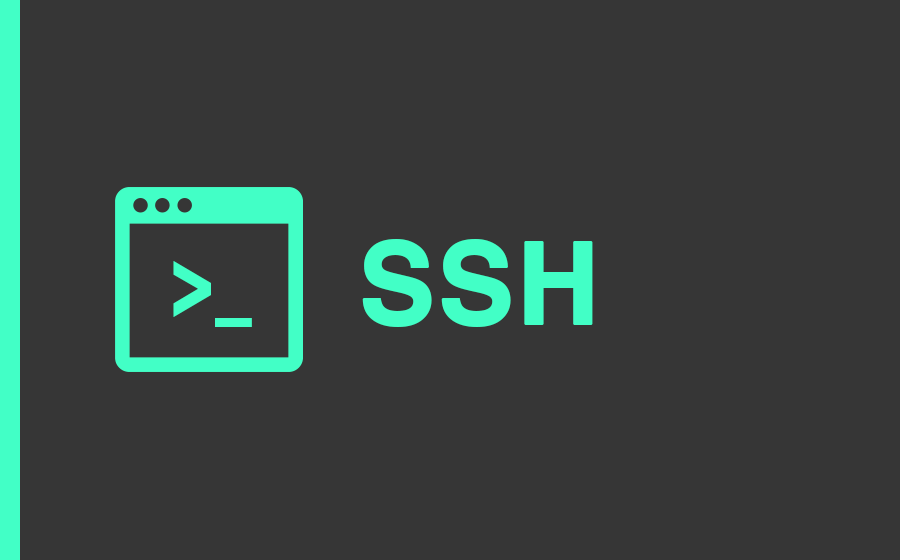

# LB 1 Olivier Grob

  

## Inhaltsverzeichnis

  
[**Vorwort**](#Vorwort)

**Umgebung**
- [VirtualBox](#Virtualbox)
- [Git-Client](#Git-Client)
- [Vagrant](#Vagrant)
- [Sicherheit](#Sicherheit)
- [Netzwerk](#Netzwerk)

**Umsetzung**
- [VM](#VM)
- [Firewall](#Firewall)
- [Apache](#Apache)

**Schluss**
- [Reflexion](#Reflexion)
- [Wissensstand](#Wissensstand)
- [Lernschritte](#Lernschritte)

**Anhang**
- [Versionen](#Versionen)


  
 # Vorwort
 ## Markdown
  Die Dokumentation ist im Markdown Format geschrieben. Das Markdown format wird in GitHub als Readme .md hochgeladen, um Benutern meines Respositories eine Anleitung zu bieten. [Wikipedia](https://de.wikipedia.org/wiki/Markdown)
  
 ## GitHub
GitHub bieten allen seinen Benutzern eine Online-Platform, auf der sie unabhängig vom Betriebssystem Projekte ablegen können. Der grosse vorteil von GitHub ist die Versionierung mittels Git (daher kommt auch die Namensgebung), dies bedeutet, dass mittels einem einfachen "Git Pull" der lokale Respository mit dem auf GitHub verglichen und nötigenfalls aktualisiert werden. Hier die [Website](https://github.com/)

# Umgebung

## VirtualBox
### Infos

Als Virtualisierungsplattform wird VirtualBox benutzt. Installiert wird dies simpel über ihre Website. [Link](https://www.virtualbox.org/wiki/Downloads).
Virtual Box bietet den vorteil, dass die meisten Vargant-Konfigurationen damit kompatibel sind.

## Git-Client
### Infos


Der Git Client ist ein kommandozeilenbasierenden Tool, mit dem wir die GitHub Respositories bedienen. Die Kommandos welche der Git Client verwendet, sind mit jenen der Linux Bash vergleichbar bzw. meistens sogar identisch.
Der Git Client kann auf dieser [Website](https://git-scm.com/downloads) heruntergeladen und installiert werden.
### Git-Client Befehle
Mittels Git-Befehle können Repositories verwaltet werden.

**GitHub Account hinterlegen**

Um mit seinen Online Repositories zu arbeiten muss der GitHub Account hinterlegt werden.
 ```Shell
      $ git config --global user.name "<username>"
	  $ git config --global user.email "<e-mail>"
 ```
**Repositories importieren**

Dies ist der Befehl mit dem die Online Respositories heruntergeladen werden.
```Shell
	$ cd Wohin\auch\immer
	$ git clone git@github.com:<Ihr Name>/my_M300.git
 ```
**Repositories runterladen**

Vor dem arbeiten an der Git Konfigurtion, sollte immer folgender Befehl ausgeführt werden:
 ```Shell
	$ git pull
 ```
 Das ausführen diesen Befehls führt dazu, dass der Lokale Respository mit dem Master auf GitHub verglichen wird. Hat der Master eine aktuellere Version als der lokale Client, wird der lokale Respository aktualisiert.
 
**Repositories hochladen**

Der lokale Resporitory kann auf GitHub hochgeladen werden, um diesen zu überschreiben bzw. zu aktualisieren. 
 ```Shell
      $ git commit -m "Mein Kommentar"
      $ git push
 ```
  

## Vagrant
### Infos


Mit Vagrant ist es möglich ganz einfach VMs zu erstellen. Dafür werden eine Vagrant Box und das Vagrantfile benötigt. Die Vagrant Box beinhaltet z.B. die virtuellen Festplatten der VM, während im Vagrant File Name, RAM grösse, CPU Anzahl etc. festgelegt werden.

### Vagrant Befehle
Vagrant wird per Git-Client mit Befehlen gesteuert.

**Neues Vagrantfile erstellen**

Mit folgendem Befehl wird in der Directory Wohin\auch\immer  ein neues Vagrant file erstellt.
```Shell
      $ cd Wohin\auch\immer
      $ vagrant init
 ```
**VM erstellen lassen**

Nach dem erstellen des Vagrantfiles kann in den Ordner gewechselt werden, in dem sich dieses File befindet. Mit folgendem Befefl wird nun eine VM erstellt:
 ```Shell
      $ cd Zum\Vagrantfile
      $ vagrant up
 ```

**Mittels SSH auf VM verbinden**

Man kann sich per SSH mit einer Vagrant VM verbinden. Dazu muss folgender Befehl im Git Client ausgeführt werden:

```Shell
      $ cd Zur\VM
      $ vagrant ssh
 ```
**VM herunterfahren**

Mit dem folgenden Befehl kann eine VM gestoppt bzw. heruntergefahren werden. 
```Shell
      $ Vagrant halt
 ```
  
 **VM löschen**
 
Eine VM die mit Vagrant erstellt wurde kann auch wieder mit Vagrant gelöscht werden. Achtung! Um die VM löschen zu können muss sie vorher heruntergefahren werden.
```Shell
      $ Vagrant destroy
 ```
 
 ### Vagrant Cloud-boxen
 Grosser Vorteil von Vagrant ist die Auswahl von den Base-boxen, aus welchen dann die VMs gemacht werden. Die Auswahl ist online auf dieser [Website](https://app.vagrantup.com/boxes/search) zu finden.
 

## Visual Studion Code


Visual Studio Code wurde von Microsoft für das editieren verschiedener Programmier und Scriptsprachen erschaffen. Von Haus aus werden bereits eine grosse Anzahl an Dateiformaten unterstützt, welche jedoch durch weitere Plugins erweitert werden können.

### Plugins
Um Plug_ins zu installieren muss die Tastenkombination `CTRL` + `SHIFT` + `X`gedrückt werden. Dann können Plug-Ins gesucht werden.
Zum arbeiten an dieser LB wurden 3 Plug-Ins benutzt:
-   Markdown All in One (von Yu Zhang)
-   Vagrant Extension (von Marco Stanzi)
-   vscode-pdf Extension (von tomiko1207)

# Sicherheit

## SSH Key zu GitHub

  

Mit SSH können Verbindungen verschlüsselt werden. Dies wird hier eingesetzt, um die Verbindung zum Online Repository zu sichern, wenn dies Importiert oder Exportiert wird.

## Firewallrules
**Regel für SSH**

Damit per SSH auf den Server verbunden werden kann, muss der **Port 22** geöffnet werden.

**Regel für http**

Damit schlussendlich auf den Webserver zugegriffen werden kann, muss der **Port 80** geöffnet werden.


## Benutzer
Vagrant erstellt automatisch einen Benutzer namens "Vagrant". Dieser hat bereits **Root** Rechte und kann somit alle benötigten Services installieren und konfigurieren.

# Netzwerk


# Umsetzung
## VM
Die VM wird im Vagrantfile folgendermassen installiert:
```Shell
Vagrant.configure("2") do |config|

config.vm.box =  "ubuntu/xenial64"

config.vm.provider "virtualbox"  do |vb|

vb.memory =  "1024"

config.vm.network "public_network", ip: "10.71.13.3"

end
 ```

## Firewall
Als Firewall wird der Dienst  "Uncomplicated Firewall" (UFW) installiert. Dies ist eine leicht zu bedienende Firewall mit wenigen Befehlen. Hier der zur [Website](https://wiki.ubuntuusers.de/ufw/) Website.

### Installation
**Installieren**

Zuerst wird der Paketdients aktualisiert. Das -y bestätigt die Installation. Der Dienst installiert wird so:
```Shell
    apt-get update
    apt-get install -y ufw gufw
 ```
**Ports öffnen**

Die Ports für SSH und http werden so geöffnet:
```Shell
	ufw allow ssh
	ufw allow 80/tcp
 ```
**Firewall Dienst starten**

Nach der Konfiguration wird die Firewall gestartet. Das yes Y bestätigt die Installation.
```Shell
	yes Y | ufw enable
 ```
 Die Firewall (UFW) wird jedes mal nach dem starten der VM automatisch hochgefahren.
 
### Test
Testen kann man die Firewall indem man sie startet und die Ports nicht geöffnet hat. Dann ist der Zugriff per SSH und HTTP blockiert.
Um den Port 22 zu überprüfen kann versucht werden mit dem Git Client auf die VM zu zugreifen. Gelingt dies ist der Port 22 richtig konfiguriert.
Um den Port 80 zu testen, kann versucht werden mittels Internetbrowser auf unseren Apache Server zu zugreifen. Hierzu muss die IP des Servers in der Suchleiste des Servers eingegeben werden.

## Apache
### Installation
Apache ist ein Webserver. Nach der Installation wird eine Standardwebseite aufgeschalten. Da es sich bei unserer VM aber um einen schnell zu installierenden Webserver handeln soll, ist es nicht nötig diese weiter zu konfigurieren.

**Installieren**

Zuerst wird der Paketdients aktualisiert. Das -y bestätigt die Installation. Der Dienst installiert wird so:
```Shell
    apt-get update
    apt-get install -y apache2
 ```

### Ergebnis
Wenn alles geklappt hat kann man die IP der VM im Browser des Hosts eingeben und die Standardwebseite erscheint.

## Testfälle

### Name der VM
Nach der ersten Testinstallation mit Vagrant ist mir aufgefallen, dass der Name der VM immer "default" ist. Ich wollte dies ändern, damit man erkennen kann, welche VM mit welchem Vagrantfile erstellt wurde.
Im Internet suchte ich nach einer Lösung. Zuerst fand ich in einem Forum den Weg, dass mit "v.name = "vmname"" die VM benannt werden kann. Vagrant bricht die Installation jedoch sofort ab.

Zum glück fand ich im gleichen Forum einen versteckten Thread, welcher beschreibt, dass mit "vb.name..." die VM benannt werden kann.
Der Text muss wie folgt ins Vagrantfile eingesetzt werden:


Der VM Name ist nun richtig eingetragen:


### Erreichbarkeit des Service

Da es sich bei meinem Service im einen Webserver handelt, ist es sinnvoll wenn dieser von ausserhalb erreichbar ist. Die Tests von meinem Host aus verliefen immer erfolgreich.
Von ausserhalb des internen Host Netzwerks konnte ich den Webserver jedoch nicht erreichen.

Die Lösung liegt im Vagrantfile. Hiermuss die Netzwerkkonfiguration auf "public" gesetzt werden.

Darun hier der Vergleich:

Vorher:


Nachher:


Der Webserver ist nun auch von anderen Geräten aus erreichbar.


# Schluss
## Reflexion
Grundsätzlich ist Vagrant eine interessante sache. Allerdings habe ich dieses Tool nich nie in einer produktiven Umgebung gesehen und würde mir daher für die Zukunft wünschen, dass wir ein in der Praxis gängiges Tool verwenden.
Mein grösster Nachteil war, dass sich meine Linux Kenntnisse etwas in Grenzen halten, wodurch ich teilweise etwas mühe hatte vorwärts zu kommen.
Die zusammenarbeit in userer Gruppe hat gut geklappt, aber da wir alles zusammen gemacht haben, haben wir nun teilweise sehr ähnliche Dokumente. Die LD verlangt dass jeder sein Projekt selbst bearbeitet, was wir auch gemacht haben, aber es wäre wünschenswert wenn wir entweder eine richtige Teamarbeit machen könnten oder gar keine.
Der Zeitaufwand wurde von mir massiv unterschätzt. Nicht desto trotz ist dieser Auftrag auch viel zu gross, als dass man alles hätte während der Schulzeit machen können.
## Wissensstand Vorher-Nachher
**Vorher:**

- Linux Vorwissen
- Apache installation gekannt
- VM

**Nachher**

Zusätzlich konnte ich lernen:

- Vagrant
- Markdown
- GitHub Handhabung
- Linux grundwissen vertiefen

## Lernschritte
1. Ich konnte Git und GitHub kennen lernen. Ich konnte zudem die Befehle kennen lernen, mit denen ich Git verwenden kann.
2. Die Erstellung einer VM mit Vagrant ist ein extrem umfängliches Thema. Besonders interessant fand ich , dass die erstellung und Konfiguration der VM später über die Kommandozeile ablief. Zudem habe ich gesehen, wie schnell eine VM mit Vagrant erstellt werden kann, im Vergleich zu einer manuellen erstellung.
3. Dokumentieren mit Markdown. Besonders interessant daran ist, dass ich jetzt endlich weiss wie die ganzen Dokumentationen im Internet aufgebaut sind, denn die meisten IT Dokus wurden mit MD-Dateien erstellt.
# Anhang
## Versionen

**Virtualbox**

Version 5.2.26 r128414

**Vagrant**

Version 2.2.4

**Visual** **Code** **Studio**

Version 1.32.3

**Git**-**Client**

Version 2.21.0

**Uncomplicated** **Firewall**

Version 0.35

**Apache**

Version 2.4